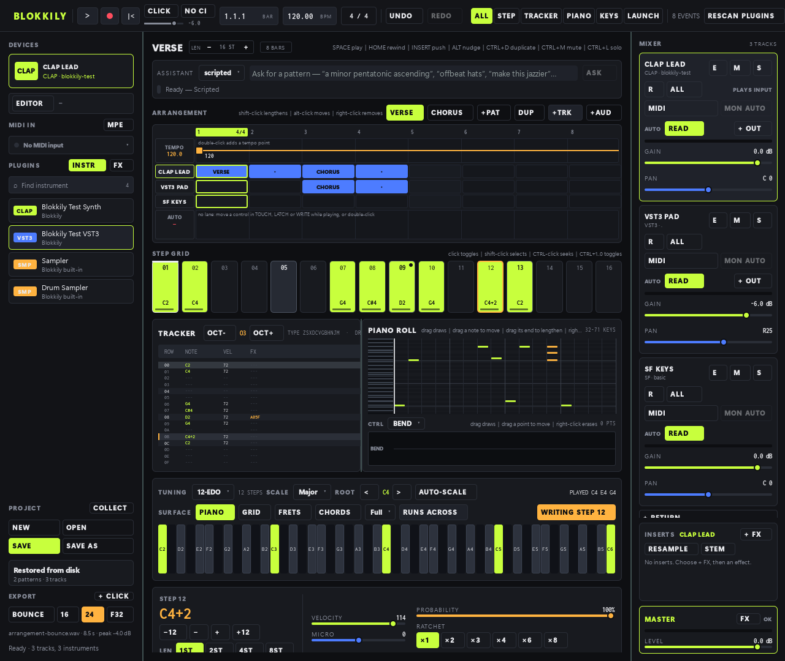

# Blokkily

Blokkily is an experimental pattern-first DAW. A single event model drives three
synchronized editors — a tracker, a piano roll, and a step grid — which are in
turn one lane of a multi-track song. CLAP is a required native plugin format,
not a compatibility add-on.



The workstation screenshot is the rendered `bdd_session_everything` session: a
song with a tempo ramp, a 7/8 bar, keyed and sliced samplers, CLAP, VST3 and
SoundFont instruments, a warped audio clip, built-in and CLAP/VST3 effects, a
return/send bus, gain and effect automation, a count-in, and two armed tracks
that took MIDI from a deterministic input. Above the editors is the prompt bar
of the LLM composition assistant (described below).

The framework-independent musical model and the real-time plugin boundary sit
underneath all of it. The model covers notes, semantic chords, inversions,
strum, microtiming, probability, ratchets, loop conditions, and parameter locks.
It also includes a native CLAP catalog that loads CLAP modules, initializes their
entry points, queries factories, and records plugin descriptors and features.
The CLAP instance adapter implements creation, initialization, activation,
sample-accurate note/parameter events, stereo processing, and state streams.
The JUCE-backed VST3 adapter scans bundles and default system locations and
instantiates plugins through the same real-time boundary, splitting each block
at parameter offsets so VST3 automation is sample-accurate too.
Parameter locks are compiled by the scheduler into sample-accurate parameter
events and applied by both plugin adapters; automation sets a parameter's value
while modulation offsets it, and neither erases the other.
The internal FluidSynth adapter loads SF2/SF3 files, accepts sample-offset note
events, renders stereo audio, selects presets, and persists its project state.
Projects save and reload the whole session: every named pattern with its chords,
locks, ratchets, microtiming, and loop conditions, the tracks with their channel
strips and clips, and the opaque state of every CLAP, VST3, and SoundFont
instrument and effect.
The allocation-free real-time transport compiles pattern ticks to sample events,
loops patterns, drives either instrument adapter, and feeds a low-latency
non-interleaved stereo RtAudio callback.

Editing while the song plays does not interrupt it. An edit recompiles the
arrangement and hands it to the render callback at the next block boundary,
without allocating on the audio thread, rebuilding the graph, reloading the
instrument, or moving the playhead; a note whose step is erased while it is
sounding is released rather than left ringing. A note entered in any editor is
auditioned through the running engine, on a stopped transport as well as a
playing one, and a session that opens with no instrument is given the machine's
General MIDI SoundFont — the percussion bank on a drum track — so the
workstation makes a sound the moment it opens.

A session is a song rather than a single pattern. Named patterns are placed as
clips on the timeline of mixer tracks, each track carrying its own instrument
and channel strip: gain in decibels, constant-power pan, mute, solo, and a peak
meter, summed through a master fader. The song engine compiles every track's
whole timeline once and then renders it without allocating, locking, or doing
I/O; each repetition of a clip counts as the next loop of its pattern, so
probability and loop conditions keep working across an arrangement. Mixer moves
reach the running engine, so a fader can be pulled while the song plays. The
same engine bounces the arrangement to a 16-bit, 24-bit, or 32-bit float WAVE
file, sample for sample identical to what was auditioned.

A session also says which tuning and which scale it is written in. Tunings are
held in cents — equal divisions of any period, rational and historical tunings,
and Scala-style lists — so twelve equal semitones are one tuning among many. A
note carries the twelve-tone key its instrument is told plus the retune away
from it, and so does each voice of a chord, which is how a nineteen-tone or
quarter-tone pattern reaches CLAP, VST3, and the SoundFont synth as the pitch it
was written at rather than as the nearest approximation. Four playable surfaces
project the same tuning and scale: a piano keyboard, isomorphic grids in seven
layouts — hexagonal and square, and each running across the window or down it —
fretboards for nine string tunings, and chord pads that name each harmony by its
numeral and stack a row per inversion. Playing one auditions it through the selected track's instrument
even on a stopped transport, and writes it onto the selected step of the
canonical pattern, where every editor names it in the song's own tuning.

A MIDI keyboard plays the song too. Its keys arrive on the port's own thread
and reach the render callback through a lock-free queue, so a note is not held
up behind a busy interface; they sound through the selected track's instrument
on a stopped song as well as a playing one, and a key of the controller is a
degree of the song's tuning and scale, the way a key of the on-screen piano is.
With recording armed, a running song writes what was played into the pattern
under the playhead: each note lands on its nearest step with how far off the
grid it was kept as micro-timing, lasts as long as the key was held, and joins
a note already on that step as a chord. What is written is what the engine
heard, at the position it heard it, and one take is one step of undo. A bounce
neither hears nor records the keyboard.

A prompt bar above the editors asks an LLM composition assistant to write into
the open pattern: a line like "a minor pentatonic ascending" or "offbeat hats"
is sent to a chosen backend (a local Ollama model by default, a Gemini or
MiniMax endpoint when keyed), the reply is parsed and clamped like any other
input, and the result sits as a proposal on the bar until the producer clicks
Apply — nothing reaches the song before then, and one generation is one undo
step. The assistant is on the GUI thread only; the audio thread never sees an
LLM call. See `docs/llm-assistant.md` for the wire dialect, backends, and the
`bdd_llm_assistant` gate that drives the rendered bar end to end without a
network.

## Build

Needs Qt 6.5+, FluidSynth, RtAudio, RtMidi, libsndfile, libsamplerate and
Rubber Band 4 (found through pkg-config), and a SoundFont for the verification
gates.

**Licence note:** clip warp (time-stretching and pitch-shifting audio clips)
links the Rubber Band Library, which is licensed under the GPL (version 2 or
later) unless a commercial licence is bought from its authors. A Blokkily
binary built with it is therefore subject to the GPL. JUCE and the CLAP headers are vendored
under `third_party/`.

```sh
cmake -S . -B build -G Ninja
cmake --build build
ctest --test-dir build --output-on-failure
./build/blokkily
```

The main executable is a Qt Quick workstation with synchronized step-grid,
tracker, and piano-roll projections over one canonical pattern, a shared
playhead, and a step inspector that exposes the model's full expression:
transposition, velocity, micro-timing, probability, ratchets, loop conditions,
and parameter locks with an automation/modulation switch. Every editor is an
input rather than a read-out: clicking a step toggles it, pressing a lane of the
piano roll writes that pitch onto the column under the pointer and dragging
draws a phrase across lanes, dragging a drawn note moves it and dragging its
right edge sets how long it sounds, the tracker's note column takes a click and
a drag, its velocity column writes how loud the row is, and its rows are typed
the way a tracker has always been typed — ZSXDCVGBHNJM
for one octave and the two rows above for the next, with the entry octave on
screen and moved by Ctrl+Left and Ctrl+Right, and Backspace clearing a row.
Ctrl+C copies the selected step and Ctrl+V pastes it onto the cursor, locks
and length included.
Whichever one is used, the edit lands on the one canonical pattern, so it shows
at once in every other editor, in the inspector, and in what the song plays; the
view switcher focuses one editor or shows them all.
Above the editors is the arrangement: one lane per track, one cell per bar.
A click on an empty bar places a clip of whichever pattern is open; a click on
a filled clip opens that pattern in every editor and seeks the song there; a
right-click takes the clip away; Shift-click lengthens a clip across bars
(one clip with several repeats, not a second placement); Alt-click moves a
clip along its lane. The numbers over those bars are a ruler: a
click locates the audio engine on that bar. Down the right
is the mixer, one strip per track plus the master. The playhead is the audio
engine's own position, read in bar.beat.sixteenth across the whole song.
Below the editors is the keyboard: the session's tuning, scale, and root, a
switch between the piano, the isomorphic grid, the fretboard and the chord pads,
and an auto-scale toggle that snaps a played key onto the notes of the scale.
The isomorphic grid carries seven layouts — Wicki-Hayden, Bosanquet, the
harmonic table and the B-system accordion on a hexagonal tiling, Jankó, fourths
and major thirds on a square one. Each is written in cents per step rather than
in semitones, so the same fingering lands in whatever tuning the song is in.
Any surface runs across the window or down it: turning one is a quarter turn, so
pitch that ran to the right runs upward, and it moves keys without touching a
note or a pitch. A surface that cannot be drawn at a playable key size scrolls
rather than shrinking its keys past the point of being hit.
Space plays, Return or Home goes back to the top of the song, the arrow keys
move and transpose the step cursor, Insert pushes later rows down and
Shift+Backspace pulls them up, Alt+arrows nudge micro-timing and note length,
Ctrl+D duplicates the selected step onto
the next row, Ctrl+1..0 (and Ctrl+Shift+1..6 for the second half of the bar)
toggles a step, Ctrl+M mutes and Ctrl+L solos the selected track, Ctrl+R arms
recording, Ctrl+E bounces the arrangement to disk, and Ctrl+K focuses the
assistant prompt bar (Escape hands the keys back to the editors). The MIDI IN
panel on the left chooses the keyboard, and its light flashes on every key that
arrives. Those keys stand aside while a text field has the keyboard, so typing
a search or a name never moves the song.

Every edit can be taken back: Ctrl+Z undoes and Ctrl+Shift+Z (or Ctrl+Y) redoes
steps, strokes, clips, tracks, patterns, fader moves and the tuning, and a drag —
a phrase drawn across the roll, a fader pulled — is one step of history rather
than one per pixel. Ctrl+S writes back to the file the session came from and
Ctrl+Shift+S asks for a new one; the window title carries a dot while there is
anything unsaved, and opening a file, starting a new session with Ctrl+N or
closing the window asks before throwing unsaved work away. DUP copies the open
pattern into a new one; a right-click on a pattern offers rename, duplicate,
clear and delete, and on a track rename, mute, solo and delete, while a
double-click on either names it. A track added with +TRK is given the SoundFont
the session already plays, so it is heard at once. A key of a playable surface
sounds when it goes down and rings until it is let go. The tempo is dragged,
scrolled (Shift for tenths) or typed after a double-click. The engine renders at
the rate the audio device actually negotiated, so a sink locked to 44.1 kHz
plays the song at its own pitch and tempo rather than flat and slow.
Its plugin browser scans the platform's standard CLAP and VST3 locations and
lists what it finds through one shared plugin boundary, tagging each entry with
the format that produced it. An installation of that size is browsed by typing
rather than by scrolling: Ctrl+F reaches the browser's field, a few letters of
a name, a maker or a format narrow the list to the instruments those letters
reach in order — "fbs" finds "Fat Bass" — the arrow keys and Return move
through them and load one, and Escape lists everything again. `./build/blokkily_cli` runs the headless scheduler
demo.

Behavior specifications are in `features/`, and repository-wide completion
rules are in `AGENTS.md`. See `docs/verification.md` for the repeatable BDD,
integration, end-to-end, and screenshot verification workflow.

## Architecture

For measured C++ line coverage with GCC, configure a separate build with
`cmake -S . -B build-coverage -G Ninja -DCMAKE_BUILD_TYPE=Debug -DBLOKKILY_COVERAGE=ON`,
then run `cmake --build build-coverage`,
`ctest --test-dir build-coverage --output-on-failure`, and
`python3 scripts/coverage.py build-coverage`.
The report and uncovered line numbers are written to `build-coverage/artifacts/coverage/`.
Vendored frameworks, generated code, QML, and the embedded GUI verification
driver are excluded from the percentage.

Playback splits dense timelines at event boundaries so notes and releases are
not dropped when the device requests a large buffer. Each track supports up to
256 simultaneous scheduled events at one sample; an edit exceeding that limit
reports an error and preserves the last playable arrangement.

- `blokkily_core`: canonical project/event model and deterministic scheduler
- `Tuning`/`Scale`/`KeyboardSpec`: cents-based tunings, scales, and the playable
  surfaces projected from them
- `Song`: named patterns, mixer tracks, and the clips that arrange them
- `SongEngine`: allocation-free multi-track playback through one mixer bus
- Offline bounce and a WAVE writer at 16-bit, 24-bit, and 32-bit float
- `PluginInstance`: format-neutral real-time boundary preserving modulation
- Qt Quick prototype: synchronized custom editors and CLAP/VST3 plugin browser
- FluidSynth internal instrument: real SF2/SF3 loading and offline rendering
- Real-time transport and RtAudio hardware-output adapter
- `MidiInput`: RtMidi port adapter that decodes, tunes, and routes keys to the
  render callback through a lock-free queue, with a deterministic mode for tests
- `TakeRecorder`: turns what the engine heard while recording into steps of the
  pattern under the playhead
- Next engine layer: Tracktion playback/recording adapter
- CLAP host adapter: discovery, lifecycle, processing, and state
- Versioned project file: the whole song plus per-instrument plugin state
- Native CLAP and VST3 plugin windows; stereo plugin ports
- Additional adapter: VST3 through JUCE

The canonical model deliberately does not use Tracktion MIDI clips. Adapters
compile it into engine and plugin events, preserving richer sequencer semantics.

## Recording, effects and audio

The tempo lane edits steps and ramps; the ruler edits the meter, keeping clips
on their bar numbers. Patterns may have different lengths. +AUD imports WAV,
FLAC or AIFF as waveform clips with trim, fades and gain. Overlaps sum. The
clip's W control enables tempo following, a manual stretch ratio or pitch
shift. Rubber Band renders those changes on a worker; a pending rendition is
silent until it is ready.

Sampler and Drum Sampler appear in the instrument browser. They support keyed
zones, loops, envelopes, kit pads and slicing. The FX browser adds CLAP, VST3
or built-in EQ, delay, reverb and compressor inserts to the selected track,
return or master rack. Sends are post-fader and pre-pan; returns remain audible
when a source track is soloed. Playback and export both compensate plugin
latency. E in an insert row opens its native window; A chooses a parameter to
edit in the selected track's automation lane. A plugin-window gesture is one
undo step, including gestures on return and master inserts.

Each track's R button arms notes and audio, and its input controls choose MIDI
channels or device inputs and monitoring. With no track armed, the selected
track records. The on-screen keyboards and tracker can record while the song
plays. Chord voices keep their own velocities and lengths. Automation has a
separate OFF / READ / TOUCH / LATCH / WRITE mode. Notes, automation and audio
from one pass share one undo step. CLICK follows the tempo and meter, CI counts
in up to four bars without moving the song, and the click is excluded from
exports unless + CLICK is enabled.

RESAMPLE in the selected rack arms its track, return or master output for the
next recording pass. Arm the transport's record button and press Play. The
output is written off the audio thread into a new audio track when the pass
ends; the destination cannot feed back into its own recording. The master tap
excludes the guide click. STEM bounces that rack through the same engine into
a new audio clip, optionally muting its source. Both actions compensate the
latency up to the selected tap. A bounced master with its sources muted also
bypasses the old master inserts and resets its fader, to avoid processing the
finished mix twice; undo restores all of these changes.

Stems are **bus taps**: a track stem contains its inserts and stereo fader/pan,
a return stem contains its sends and return processing, and a master stem
contains the complete mix. Track stems exclude their sends' return signals;
bounce the returns too when reconstructing the mix. The sum of track and return
stems is the signal before master processing. A nonlinear master effect cannot
be distributed among independent stems. Muting a source track also stops its
sends, so bounce those returns separately if they must be kept.

A compressor in a rack has a SIDECHAIN chip: choose another track and the
compressor listens to that track instead of to what it compresses. The key is
the source track after its own inserts and before its fader, so a muted or
faded-down kick still ducks the bass; the engine renders a key's source first,
and refuses a key from the insert's own track or a loop of keys. The
MODULATION panel under the inspector adds LFOs (sine, triangle, saws, square,
random; rate in Hz), macros (one 0..1 knob) and envelope followers (the level of
a chosen track, after its inserts and before its fader). + TARGET aims one at a
parameter of the selected track's instrument or inserts, with a depth of -100%
to +100% of that parameter's range. A modulation is an offset on top of the
parameter's own value and automation, sent as CLAP parameter modulation (and
the equivalent on VST3 and built-in effects), never written into a lane;
several on one parameter add up. Rates, shapes, depths and macros move live
without a recompile. Modulators and keys are saved with the song, undone with
it, and exported exactly as they play: while the song rolls an LFO's phase is
taken from the song position.

The LAUNCH view is a scene launcher: scenes down, tracks across, each cell
naming one of the song's patterns (the same pattern the editors edit).
Clicking an empty cell puts the open pattern in it; clicking a filled cell
launches it on its track at the cell's quantization (none, a sixteenth, a
beat, one, two or four bars), and a scene's chip launches its whole row at the
grid's quantization. A cell can play a number of loops and then follow on
(stop, next, previous, first, last, random or again). Launches, stops, loop
turns and follow actions happen on the exact sample of their boundary, inside
the render callback, and a launched track plays its cell instead of its
arrangement until the transport stops. With REC ARRANGEMENT on, every stretch
a track played from one cell is printed into the arrangement as clips when it
ends, one step of undo each; the printed arrangement plays and exports what
was heard, sample for sample. The grid is saved with the song.

Imported files stay where they are. Recordings go into `<project>.audio/`, or
a temporary session folder before the first save. COLLECT copies referenced
clips and sampler samples into the saved project's audio folder, deduplicates
shared files, and changes their references as one undoable edit. Save afterwards
to persist those references. Original files are kept so undo remains playable.

## What is not here yet

- MIDI input handles notes; pitch bend, sustain, other controllers and MIDI
  clock are not recorded. Notes are timestamped to the callback block.
- Long audio files stream from disk through lock-free ring buffers on a
  background worker rather than consuming RAM; an underrun softly fades to
  silence rather than clicking. RAM decoding remains the path for short
  files and sampler playback. Comping (taking alternate passes of a recorded
  lane) is not here yet.
- The sampler panel loads one file at a time; it has no multi-sample import
  wizard, velocity-layer editor or waveform editing surface.
- Step parameter locks target the track instrument. Insert parameters use
  automation lanes; insert-targeted step locks remain outside this release.
- Multi-output plugins: an instrument's auxiliary output ports are not broken
  out to mixer tracks. Only the built-in compressor listens to a sidechain key;
  a CLAP or VST3 effect's own sidechain input port is not fed yet.
- Modulation is evaluated once per block (at most the device's block size) and
  follows no tempo sync from the panel (the model and engine support synced
  LFOs). A follower aimed at its own track, or at a track the render order
  cannot put after its source, hears the previous block's level.
- The scene launcher has no per-scene tempo; launched tracks stop when the
  engine is rebuilt (a track or instrument added, changed or removed) and for
  an export, which is always the arrangement. A take printed over a clip that
  ran past the take's end cuts that clip where the take began.
- Output recording chooses one bus per pass. Bounce additional racks for a
  set of stems. A partial live pass ends when recording stops and does not
  automatically append effect tails; offline stems include them.
- Native plugin-window pixels require an X11 display. Offscreen verification
  checks the embedding lifecycle, while the separate display gate checks
  real VST3 pixels when an X server is available.
